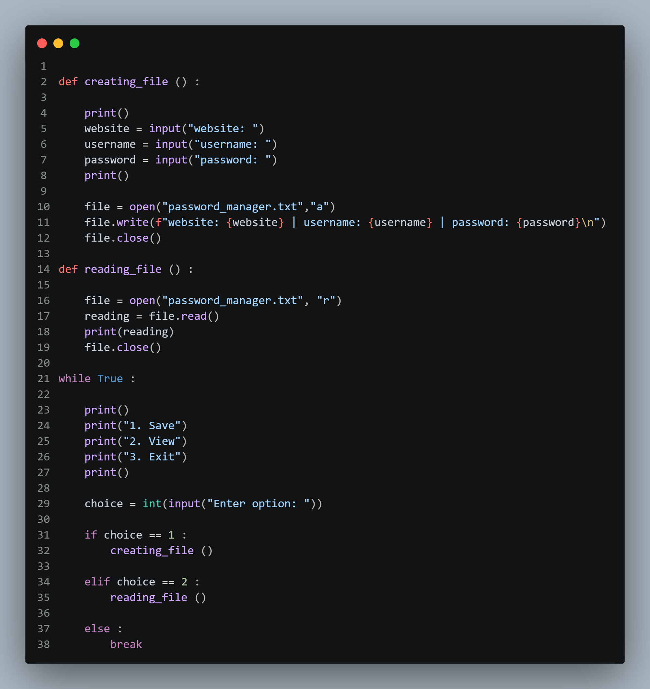

# Simple Password Manager (Python)

This is a beginner-friendly **password manager** built using Python.  
It allows users to store and view account credentials in a text file.

## Features
- Save passwords (website, username, password)
- Store data in a file automatically
- View saved passwords anytime

## Screenshot

## What I Learned
- File handling in Python (open, read, write)
- Using functions to organize code
- Building simple real-world tools

## ⚠️ Disclaimer
This project is for learning purposes only.  
Passwords are stored in **plain text** and are not encrypted.

## Future Improvements
- Add encryption for better security
- Implement a master password system
- Add search functionality for saved accounts

## Author
Abdullatif Traisi
